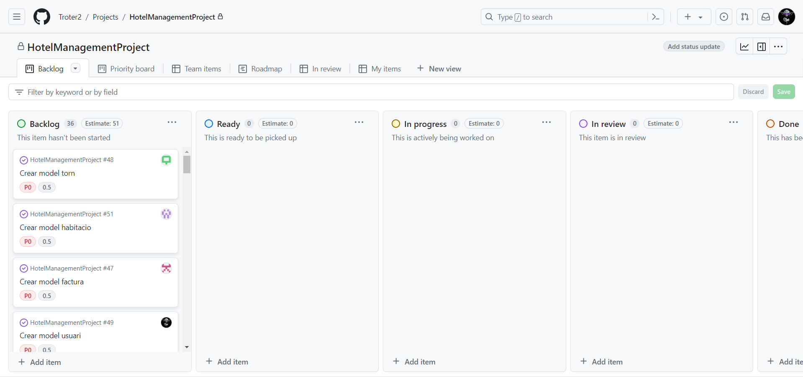

# Sprint Planing Title (12-03-2024)

| Assistant            | Role             |  
|----------------------|------------------|
| Marc Ferreres        | Developer        |   
| Josep Prades         | Front-End Expert |  
| Adria Creus          | Scrum Master     |  
| Sergi Vila           | Back-End Expert  |  
| Joan Carles Turégano | VCS Master       |

## Spring Planing Overview

*Here you need to include a picture of the Spring Planning in the model Kanban*

Considering the proposed distribution in the model Kanban, the overall activities to be performed by the team are: 

| Team Member          | Overall Task Desription                           |  
|----------------------|---------------------------------------------------|
| Sergi Vila           | Create home page                                  |   
| Sergi Vila           | Create login page x                               |   
| Sergi Vila           | Create book list for check in                     |   
| Sergi Vila           | Create book list for check out                    |   
| Sergi Vila           | Create a list with all room types                 |   
| Sergi Vila           | Crete pop up with booking information             |   
| Sergi Vila           | Crete booking verification for free rooms on date |   
| Sergi Vila           | Save guest information for authority              |   
| Sergi Vila           | Create button to validate booking                 |   
| Josep Prades         | Create list to visualize rooms status             |  
| Josep Prades         | Create a button to modify room status             |  
| Josep Prades         | Create table to assign shifts                     |  
| Josep Prades         | Pop up to confirm checkout                        |  
| Josep Prades         | Form to realize checkout                          |  
| Josep Prades         | Create booking for customers form                 |  
| Josep Prades         | Auto update rooms status in view                  |  
| Adrià Creus          | Create reservation filter                         |  
| Adrià Creus          | Create booking form                               | 
| Adrià Creus          | Create what to do page                            |
| Adrià Creus          | Create contact page                               |
| Joan Carles Turegano | Check out filter from                             | 
| Marc Ferreres        | Generate pdf with reservation data                 |  
| Marc Ferreres        | Create list to visualize restaurant reserves       |  
| Marc Ferreres        | Create form to send host data to autorities        |  

